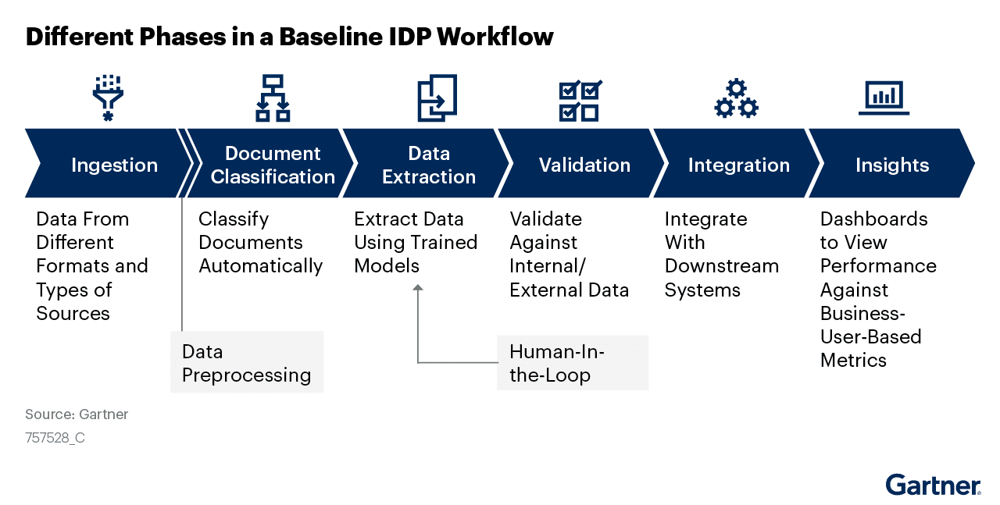
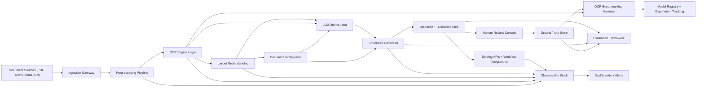
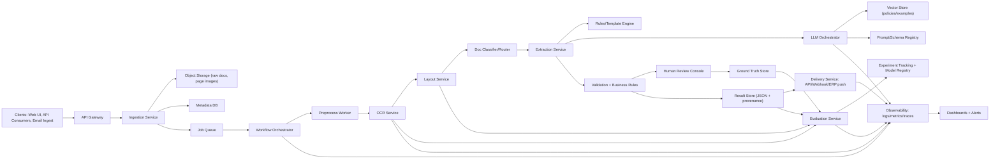

# **Intelligent Document Processing (IDP)**

## **Amazon**
- [https://aws.amazon.com/what-is/intelligent-document-processing/](https://aws.amazon.com/what-is/intelligent-document-processing/)

## **Microsoft**
- [What is intelligent document processing?](https://www.microsoft.com/en-us/power-platform/products/power-automate/topics/business-process/intelligent-document-processing)

## **Google**
- [https://cloud.google.com/document-ai](https://cloud.google.com/document-ai)

## **DataBricks**
- [What is Intelligent Document Processing?](https://www.databricks.com/blog/intelligent-document-processing)

## **Hyperscience Resource Center**
- [Intelligent Document Processing (IDP)](https://www.hyperscience.ai/resource/intelligent-document-processing/)

- `OCR (Optical Character Recognition)` is a technology that converts different types of documents, such as scanned paper documents, PDFs, or images captured by a digital camera, into editable and searchable data. It uses machine learning algorithms to recognize and extract text from images, making it possible to digitize and process large volumes of documents efficiently. OCR is commonly used in various applications, including document management systems, data entry automation, and information retrieval.

- `NLP (Natural Language Processing)` is a branch of artificial intelligence that focuses on the interaction between computers and humans through natural language. It enables machines to understand, interpret, and generate human language in a valuable way. NLP combines computational linguistics with machine learning, deep learning, and statistical modeling to process and analyze large amounts of natural language data. Applications of NLP include chatbots, sentiment analysis, language translation, and information extraction from unstructured text data.

- `CV (Computer Vision)` is a field of artificial intelligence that enables computers to interpret and understand visual information from the world. It involves the development of algorithms and models that can analyze and process images and videos to extract meaningful insights. Computer vision applications include image recognition, object detection, facial recognition, and autonomous vehicles. By combining OCR, NLP, and CV, intelligent document processing systems can effectively handle a wide range of document types and extract valuable information for various business applications.

- `ML (Machine Learning)` is a subset of artificial intelligence that focuses on the development of algorithms and statistical models that enable computers to learn from and make predictions or decisions based on data. In the context of intelligent document processing, machine learning techniques are used to improve the accuracy and efficiency of OCR, NLP, and CV tasks. For example, machine learning can be applied to train models for better text recognition in OCR, enhance language understanding in NLP, and improve object detection in CV. By leveraging machine learning, intelligent document processing systems can continuously learn and adapt to new document types and formats, ultimately providing more accurate and reliable results.

---

### Use cases for intelligent document processing

IDP is used across industries. Here are some intelligent document processing use cases:

- `Finance` departments can automate accounts payable functions such as processing invoices.
- `Human Resources` departments can process resumes, screen employees, and process employee surveys and other HR data with IDP.
- `Government` agencies manage permits, issue e-documents, and process applications with intelligent document processing software.
- `Insurance` companies use automation document processing to process claims, detect fraud, triage insurance policies, and expedite your organization’s document processing.
- `Law` firms can process, archive, and manage legal data with higher accuracy than manual document processing using IDP.

### Reference architecture for a production-grade IDP platform.

**Overview By Capability**

1. `Classical OCR fundamentals`  
Use detection + recognition (+ language model/decoder). Prefer pluggable engines (Tesseract, PaddleOCR, TrOCR, cloud OCR) behind one interface.

2. `Image preprocessing`  
Denoise, deskew, binarize, contrast normalization, orientation correction, page splitting, border removal. Keep originals and processed versions for auditability.

3. `OCR benchmarking`  
Create fixed benchmark sets per doc type and language. Track CER(Character Error Rate), WER(Word Error Rate), field-level accuracy, latency, and cost per page.

4. `Layout understanding`  
Detect regions (title, table, key-value, paragraph, stamp, signature) with models like LayoutLM/DiT/DocLayout-style detectors.

5. `Document intelligence`  
Classify document type, detect intent, route to extraction templates, apply policy/risk checks.

6. `Structured extraction`  
Hybrid strategy: rules/templates + ML extractors + LLM extraction. Output strict JSON schemas with confidence per field and provenance spans.

7. `Evaluation framework`  
Run offline and online evals: OCR quality, extraction F1, schema-valid rate, hallucination rate, human correction rate, SLA compliance.

8. `Production serving ` 
Event-driven pipeline (queue + workers), idempotent jobs, retries, dead-letter queues, model/version pinning, multi-tenant API.

9. `Monitoring`  
Observe quality, drift, latency, throughput, failure modes, and cost. Alert on metric regressions and confidence collapse per document type.

10. `OCR + LLM systems`
Pass OCR text + layout coordinates + page images to an LLM orchestrator with:
- Prompt templates per document class
- Retrieval of domain rules/examples
- JSON schema constrained decoding
- Guardrails (PII, policy, consistency checks)
- Deterministic fallback when LLM confidence is low

**Design Principles For Efficiency**
1. Route-by-confidence: cheap deterministic path first, LLM fallback second.  
2. Cache intermediate artifacts (preprocessed images, OCR tokens, layout blocks).  
3. Human-in-the-loop only for low-confidence or policy-critical cases.  
4. Continuous evaluation loop: production errors become new training/eval samples.

---

**Microservice Breakdown**
1. `Ingestion Service`: accepts PDFs/images, normalizes metadata, creates jobs.
2. `Workflow Orchestrator`: state machine, retries, timeout handling, idempotency.
3. `Preprocess Worker`: deskew, denoise, orientation, binarization, page splitting.
4. `OCR Service`: pluggable OCR engines, outputs tokens with bounding boxes/confidence.
5. `Layout Service`: region detection, reading order, table/key-value candidates.
6. `Classifier/Router`: document type + route to extraction strategy.
7. `Extraction Service`: combines rules and LLM extraction under strict JSON schema.
8. `Validation Service`: field checks, cross-field logic, policy gates, confidence thresholds.
9. `Human Review Console`: exception handling and corrections.
10. `Evaluation Service`: CER/WER, field F1, schema-valid rate, latency/cost quality trends.
11. `Delivery Service`: publishes results to APIs, queues, downstream systems.
12. `Observability Stack`: logs, traces, metrics, alerts, drift detection.

**Phased Implementation Plan**

1. **Phase 0 (Week 1-2): Platform Foundation**  
Scope: API gateway, object storage, metadata DB, queue, orchestrator skeleton, auth/audit.  
Exit criteria: end-to-end job lifecycle works with mock OCR.

2. **Phase 1 (Week 3-5): OCR MVP**  
Scope: preprocessing + one OCR engine + raw text output + basic dashboard.  
Exit criteria: stable OCR for 1 doc family, baseline CER/WER and p95 latency measured.

3. **Phase 2 (Week 6-8): Layout + Structured Rules**  
Scope: layout detection, document classification, template/rule extraction for top fields.  
Exit criteria: field-level F1 baseline established, JSON schema-valid rate > target.

4. **Phase 3 (Week 9-11): OCR + LLM Extraction**  
Scope: LLM orchestrator, prompt/schema registry, retrieval of policy/examples, fallback logic.  
Exit criteria: measurable lift vs rules-only on hard docs, hallucination checks in place.

5. **Phase 4 (Week 12-13): Evaluation + HITL Loop**  
Scope: benchmark harness, golden datasets, review UI, correction-to-ground-truth feedback loop.  
Exit criteria: continuous evaluation pipeline and weekly quality report automated.

6. **Phase 5 (Week 14-16): Production Hardening**  
Scope: autoscaling, DLQ/replay, SLOs, cost controls, tenant isolation, disaster recovery.  
Exit criteria: production SLOs met, alerting tuned, rollback/versioning playbooks validated.

**Suggested MVP Targets**
1. OCR CER < 8% for target doc type.
2. Critical field F1 > 0.90.
3. Schema-valid outputs > 98%.
4. p95 processing time < 20s per document.
5. Human-review rate < 15% after stabilization.

---

1. **Phase 0: Platform Foundation (Week 1–2)**  
Major tools:
- `FastAPI` (ingestion/API surface)
- `Temporal` (workflow orchestration, retries, idempotency)  
Also common: `PostgreSQL`, `MinIO/S3`, `Keycloak`.

2. **Phase 1: OCR MVP (Week 3–5)**  
Major tools:
- `OpenCV` (deskew, denoise, thresholding, orientation)
- `PaddleOCR` (strong OCR baseline; multilingual support)  
Also common: `Tesseract`, `Pillow`, `docTR`.

3. **Phase 2: Layout + Structured Rules (Week 6–8)**  
Major tools:
- `LayoutParser` (document layout detection pipeline)
- `Detectron2` (region detection models for blocks/tables/headers)  
Also common: `pdfplumber` (PDF text/geometry), `spaCy` + `regex` (rule extraction).

4. **Phase 3: OCR + LLM Extraction (Week 9–11)**  
Major tools:
- `vLLM` (high-throughput LLM serving)
- `LangChain` or `LlamaIndex` (LLM orchestration + retrieval pipelines)  
Also common: `FAISS/pgvector` (retrieval), `Pydantic` or `Instructor` (schema-constrained output).

5. **Phase 4: Evaluation + HITL Loop (Week 12–13)**  
Major tools:
- `MLflow` (experiment tracking/model registry)
- `Label Studio` (human review and correction workflows)  
Also common: `Ragas`/`DeepEval` (LLM eval), `Evidently` (data/quality drift monitoring).

6. **Phase 5: Production Hardening (Week 14–16)**  
Major tools:
- `Kubernetes` (scaling, resilience, deployment control)
- `Prometheus + Grafana` (metrics, alerting, SLO dashboards)  
Also common: `OpenTelemetry` + `Jaeger` (tracing), `Argo CD` (GitOps deploys), `Loki/ELK` (logs).

---

### *How does intelligent document processing work?*

`IDP` works by using AI to read, classify, extract and structure information from different types of documents in the processing pipeline automatically. The following is a high-level overview of how `IDP` systems process documents:

- `Document ingestion:` Documents enter the system as inputs from multiple sources.
- `Document preprocessing:` The system cleans and prepares the documents.
- `Optical character recognition:` Documents are scanned and text is converted to machine readable text.
- `Document classification:` Trained models classify document types.
- `Data extraction:` The system extracts specific fields needed using NLP and layout analysis.
- `Data validation:` Extracted data is checked for accuracy. If AI is unsure, a human reviewer verifies or corrects the data.
- `Data Structuring:` The validated data is converted into structured formats to make the information usable for business systems.
- `Workflow ingestion and automation:` The processed data is sent to downstream systems.

### *How to assess intelligent document processing software*

Selecting the right IDP software requires evaluating its capabilities, accuracy, scalability, integration and ROI. Since IDP involves multiple technologies, you need a structured approach to determine if a platform meets your business needs. Here’s a framework for assessing IDP software:

- `Document compatibility`: Can the software handle different document types, formats and languages and support both structured and unstructured documents?
- `Data extraction accuracy`: Test with real documents to look for OCR and NLP accuracy, table and line-item recognition accuracy and confidence scoring for extracted fields.
- `AI and ML capabilities`: AI learning capabilities should improve over time and include learning from corrections, adaptability to new document templates and support for multiple AI models.
- `Integration with existing systems`: Can the software automatically route data to ERP, CRM or HR systems, trigger workflows and support human-in-the-loop exception handling?
- `Implementation and scalability`: Consider current and future volumes to test if it can handle peak loads efficiently and scale in the cloud or on premises.
- `Governance and security`: Check for data encryption at rest or in transit, role-based control and compliance with industry regulations.
- `Vendor support and maintenance`: Assess quality of vendor support, frequency of updates, availability of AI model improvements and community and documentation resources.

---

Recommended build order:

1. `ingestion_service`  
2. `workflow_orchestrator` (basic state machine + queue publish/consume)  
3. `preprocess_worker` + `ocr_service` (first functional pipeline)  
4. `layout_service`  
5. `classifier_router_service` + `extraction_service`  
6. `validation_service`  
7. `delivery_service`  
8. `evaluation_service` + `observability_stack`  
9. `human_review_console`

---