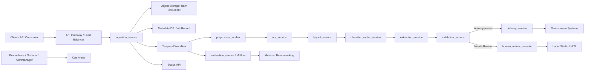

Move the stack from Docker Compose toward Kubernetes, but for real production I would not use Minikube as the orchestrator.

Minikube is best as a local Kubernetes test target, similar to how this repo currently uses Compose as a local stack. For production, use a real Kubernetes distribution: managed Kubernetes like EKS/GKE/AKS, or on-prem options like RKE2, k3s, OpenShift, or kubeadm-backed clusters.

This repo is a good candidate for Kubernetes because the service boundaries are already clean: FastAPI services, Temporal worker, Postgres, Redis, SeaweedFS, MLflow, Label Studio, Prometheus, Grafana. The current Compose file already maps the pieces clearly in [docker-compose.yml](/Users/user/Projects/intelligent_document_processing/docker-compose.yml:3), and the docs call out horizontal scale points in [infra/STACK.md](/Users/user/Projects/intelligent_document_processing/infra/STACK.md:40).

Recommended path:

1. Keep `docker-compose.yml` for local developer bootstrap.
2. Add Kubernetes manifests or Helm charts under something like `infra/k8s/` or `charts/idp/`.
3. Use Minikube only to validate the Kubernetes packaging locally.
4. Use a production Kubernetes cluster for real deployment.
5. Externalize state carefully: Postgres, SeaweedFS/object storage, Label Studio data, MLflow artifacts, Grafana/Prometheus volumes.
6. Convert `.env` into `ConfigMap` and `Secret` resources.
7. Convert app services into `Deployment` + `Service`, with readiness/liveness probes matching the current healthchecks.
8. Treat GPU/vLLM separately with node selectors, resource requests, GPU runtime support, and probably its own profile/values file.

The biggest production concern is state. Compose currently owns named volumes for Postgres, SeaweedFS, Label Studio, Prometheus, Alertmanager, and Grafana in [docker-compose.yml](/Users/user/Projects/intelligent_document_processing/docker-compose.yml:455). In Kubernetes, those need deliberate `PersistentVolumeClaim`s, backup policy, storage class choice, and restore testing.

So: move to Kubernetes, yes. Move to Minikube for production, no. Use Minikube as the rehearsal room; use a real Kubernetes cluster for the stage.


---

Move from Docker Compose to Minikube, but for real production I would not make Minikube the final target.

Minikube is excellent as a **local Kubernetes migration and testing bridge**. It lets you convert the IDP stack into Kubernetes manifests or Helm charts, test service discovery, secrets, config maps, persistent volumes, probes, resource limits, and scaling behavior. But Minikube is still a **single-node local/dev Kubernetes distribution**, not a production-grade cluster.

For this IDP project, the better path is:

1. **Docker Compose now**
   - Good for local development, single-host validation, and quick E2E testing.

2. **Minikube next**
   - Good for learning Kubernetes deployment shape.
   - Useful for testing manifests for services like `ingestion-service`, `ocr-service`, `layout-service`, `workflow-orchestrator`, `extraction-service`, `validation-service`, etc.
   - Good place to introduce Helm/Kustomize.

3. **Production Kubernetes after that**
   - Use a real cluster: EKS, GKE, AKS, k3s, RKE2, OpenShift, or on-prem Kubernetes.
   - Add proper ingress, TLS, persistent storage, autoscaling, secrets management, backup/restore, monitoring, logging, and GPU node support if using VLM/Layout heavy workloads.

For your architecture specifically, production Kubernetes makes sense because the IDP stack already has natural service boundaries:

- `ingestion-service`
- `workflow-orchestrator`
- `preprocess-worker`
- `ocr-service`
- `layout-service`
- `classifier-router-service`
- `extraction-service`
- `validation-service`
- `human-review-console`
- `delivery-service`
- `evaluation-service`
- `Temporal`
- `Postgres`
- `SeaweedFS` or another S3-compatible object store
- `Prometheus/Grafana`
- optional GPU-backed VLM service

The only caution: **do not treat Minikube itself as production**. Treat it as the rehearsal stage.

A sane migration plan would be:

```text
Docker Compose
  -> Minikube with Kubernetes manifests
  -> Helm/Kustomize packaging
  -> staging Kubernetes cluster
  -> production Kubernetes cluster
```

For production, I’d prioritize:

- Managed or well-operated Kubernetes cluster
- External managed Postgres or a properly backed-up Postgres operator
- Durable object storage, preferably S3/MinIO/SeaweedFS with persistence and backup
- Temporal deployed via Helm
- Separate worker deployments with resource limits
- Horizontal scaling for stateless services
- GPU node pool only for VLM/layout workloads if needed
- Secrets via Kubernetes Secrets, External Secrets, Vault, or cloud secret manager
- Ingress controller with TLS
- Centralized logs and metrics
- E2E pipeline tests before promotion

So the short version: **move to Minikube as a Kubernetes stepping stone, not as production.** For real production, move from Compose to proper Kubernetes, using Minikube only to develop and validate the Kubernetes deployment model.


---

In production, the IDP system should behave like an **asynchronous document-processing platform**, not a single request/response OCR API.

The user uploads a document, gets a `job_id` immediately, and the system processes the document through a durable workflow until it is either delivered, routed to human review, or failed with traceable diagnostics.



**Production Runtime Flow**
1. **Document Intake**
- Client uploads document to `ingestion_service`.
- API validates auth, tenant, file type, size, idempotency key, and request metadata.
- Raw file is stored in object storage.
- Job metadata is stored in Postgres.
- Temporal workflow is started.
- Client receives `job_id` immediately.

2. **Async Pipeline Execution**
- `workflow_orchestrator` executes each stage reliably through Temporal.
- Each stage reads/writes artifacts from object storage.
- Each service remains stateless where possible.
- Temporal handles retries, timeouts, and workflow state.

3. **Processing Stages**
- `preprocess_worker`: deskew, denoise, threshold.
- `ocr_service`: text tokens, bounding boxes, confidence.
- `layout_service`: page/block segmentation.
- `classifier_router_service`: document type/profile routing.
- `extraction_service`: structured field extraction.
- `validation_service`: confidence and business-rule gating.

4. **Decision Branch**
- If validation passes, `delivery_service` publishes the final structured payload.
- If validation fails or confidence is low, `human_review_console` creates a review task in Label Studio or local queue fallback.
- Human corrections should later feed your gold dataset/evaluation loop.

5. **Status and Results**
- Clients poll:
```text
GET /documents/{job_id}
GET /documents/{job_id}/result
```
- Status should clearly show:
```text
QUEUED -> RUNNING -> COMPLETED
```
or:
```text
FAILED / NEEDS_REVIEW / DELIVERED
```

**Production Infrastructure**
For real production, move from Docker Compose to Kubernetes or another orchestrator.

**Recommended production components:**
- API Gateway / Ingress Controller
- Kubernetes Deployments per service
- Temporal cluster
- Postgres managed or HA
- S3-compatible object storage
- Redis only where needed
- Prometheus, Grafana, Alertmanager
- MLflow tracking backend
- Label Studio or custom HITL console
- Secret manager
- Centralized logs

**Scaling Model**
Scale independently by bottleneck:

```bash
preprocess_worker: CPU/image-heavy
ocr_service: CPU/GPU-heavy
layout_service: CPU/GPU-heavy
extraction_service: LLM/API-bound
workflow_orchestrator: workflow concurrency
validation_service: lightweight
delivery_service: downstream throughput
```

The ingestion API should not do heavy OCR work directly. It should stay fast and only enqueue durable jobs.

**Security Model**
Production should enforce:
- Tenant isolation on every API and artifact path.
- API keys/JWT/OIDC at gateway and service level.
- Object storage encryption.
- Database encryption.
- Audit logs for upload, processing, review, delivery.
- File type validation.
- Malware scanning if documents come from external users.
- PII redaction where needed.
- Secret manager for tokens/passwords.
- No secrets in logs or MLflow params.

**Monitoring**
Prometheus/Grafana should track:
- Service health
- Request latency
- 4xx/5xx rates
- Workflow failures
- Stage duration
- OCR fallback rate
- Human-review rate
- Delivery failures
- Evaluation metrics
- Queue/workflow backlog

Alertmanager should notify when:
- A critical service is down.
- Workflows fail above threshold.
- OCR/extraction latency spikes.
- Human-review backlog grows.
- Delivery failures increase.

**Evaluation In Production**
Use three evaluation loops:

1. **Smoke e2e**
- `sample_invoice_001.png`
- Fast sanity check after deploy.

2. **Benchmark datasets**
- CORD-v2, SROIE, DocLayNet.
- Used before releases.

3. **Private gold datasets**
- Your real redacted documents.
- Most important for production readiness.

Metrics should flow into `evaluation_service` and MLflow.

**Ideal Production Outcome**
A production document should end in one of three clean states:

```text
DELIVERED
```
Structured output was confidently extracted and sent downstream.

```text
PENDING_HUMAN_REVIEW
```
The system protected quality by routing uncertain output to HITL.

```text
FAILED
```
A recoverable or non-recoverable failure occurred, with logs, artifacts, workflow history, and retry diagnostics available.

The key principle: **production IDP should optimize for traceable correctness, not just successful OCR.**


```
[Client / API Consumer]
             │
             ▼
  [API Gateway / Load Balancer]
             │
             ▼
     [ingestion_service] ─────────────────────────────► [Status API]
       │               │               │
       ▼               ▼               ▼
  [Raw Doc Obj]   [Job Rec DB]   [Temporal Workflow] ──► [evaluation_service / MLflow] ──► [Metrics]
                                       │
                                       ▼
                               [preprocess_worker]
                                       │
                                       ▼
                                 [ocr_service]
                                       │
                                       ▼
                                [layout_service]
                                       │
                                       ▼
                           [classifier_router_service]
                                       │
                                       ▼
                              [extraction_service]
                                       │
                                       ▼
                              [validation_service]
                                 │              │
                  (Auto-approved)        (Needs Review)
                                 │              │
                                 ▼              ▼
                        [delivery_service]   [human_review_console]
                                 │              │
                                 ▼              ▼
                        [Downstream Systems] [Label Studio / HITL]

  [Prometheus / Grafana / Alertmanager] ──► [Ops Alerts]
```